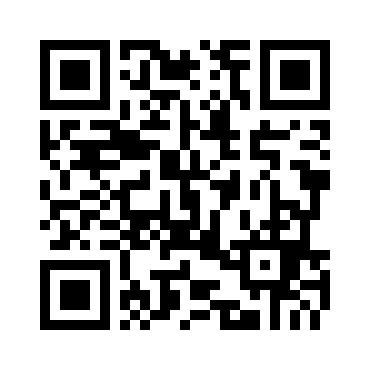

# Portfolio QR Code

Scan the QR code below to open my portfolio:

<p align="center">
  <a href="https://samuel-abera-mekonn.netlify.app/">
    
  </a>
</p>

Portfolio: [samuel-abera-mekonn.netlify.app](https://samuel-abera-mekonn.netlify.app/)

## Generate the QR code

Install the project dependencies and run:

```bash
python main.py
```

This regenerates `portfolio_qr.png` from the URL defined in `main.py`.